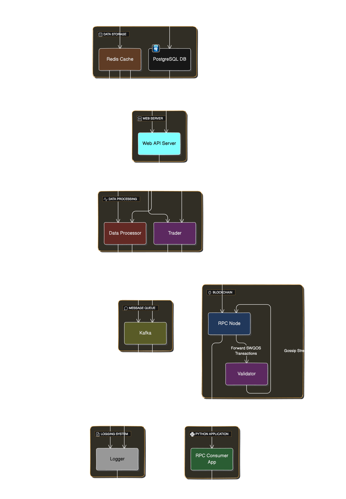

<h1>Solana Token Data Ingestor</h1>

## Description
This project, which is in progress, is an G/RPC listener that listens for token transactions on the Raydium Constant Product AMM on the Solana Blockchain. The ingestor listens for swap transactions and mints along with burns if enabled. It continuously listens for these events and computes price, volume, and holdings changes; constantly caching then streaming the data via Kafka. From there, the data is then served through a RESTful API to trading and analytical microservices. The token data processing is done in golang for speed, the client API is built using FastAPI, and the G/RPC listener is in pure python. The database used is TimescaleDB and Interservice communication is done via Redis Pub/Sub and Kafka. Redis, Redis Commander, and TimescaleDB are currently being deployed using Docker Compose. **You must have a pre-existing Kafka broker to run the project**. It is recommended to host TimescaleDB, Kafka, and Redis on a cloud provider such as AWS, GCP, or Azure. For lowest latency, it is recommended to host the services in the same region/data center.

## Tech Stack
| Icon | Name | Description |
|---|---|---|
|  | Python | For the G/RPC listener and API |
|  | FastAPI | Framework for the API |
|  | Go | For token data processing |
|  | Redis | For caching and pub/sub |
|  | Kafka | Persistence Queue | 
|  | Docker | For containerization |
|  | TimescaleDB | Time series database for token data |
| | ~~PostgreSQL~~ | ~~For persistent storage~~ (Migrated to TimescaleDB) |
|  | ~~Prisma~~ | ~~As the ORM~~ (Removed during migration) |

## Updated Program Flow Diagram


## Installation and Build 

### Clone the repository
```bash
git clone https://github.com/Zaydo123/Solana-RPC-Listener
```
### Go to the project directory
```bash
cd Solana-RPC-Listener
```
### Create Environment Variables
Check the `.env.example` file in the root directory and create a `.env` file with the same variables and values.
<a href="./.env.example">Click here to view</a> 

### Dependencies for the Python API, G/RPC listener, Logger, and API

In the apps directory, run the following command to install the dependencies:
```bash
pip install -r requirements.txt
```

### Running the API:
production run command
```bash
gunicorn -k uvicorn.workers.UvicornWorker main:app
```

development run command - configured with uvicorn
```bash
python main.py
```

### Running the RPC Consumer:
for both dev and prod run the following command:
```bash
python main.py
```

### Building the token data processor written in Go
to build from source, download Go and change directory to the `token-data-processor` directory.
Then run the following commands:
```bash
go build cmd/token-processor/main.go
```
run with the following command:
```bash
./main
```

### Starting TimescaleDB, Redis, Redis Commander
Managed using Docker Compose. Run the following command in the root directory:
```bash 
docker compose up -d
```

Your application should now be running!
check redis commander on port 8080 and the API on port 3000 by default.

# Common Issues
1. Pyscopg2 not installing on MacOS
   1. Install Homebrew
   2. Install openssl - `brew install openssl`
   3. If Processor >= M1 Chip:
      - `export LIBRARY_PATH=$LIBRARY_PATH:/opt/homebrew/opt/openssl/lib` - Adds openssl to the library path
    - Intel Macs:
      - `export LIBRARY_PATH=$LIBRARY_PATH:/usr/local/opt/openssl/lib/` - Adds openssl to the library path
   4. `pip install psycopg2`


## Notes
- Database automatically creates tables and columns on first run.
- Migration to TimescaleDB is in progress.
- The project is still in progress and is not yet complete.
- Trading services are not being shared in this repository.

