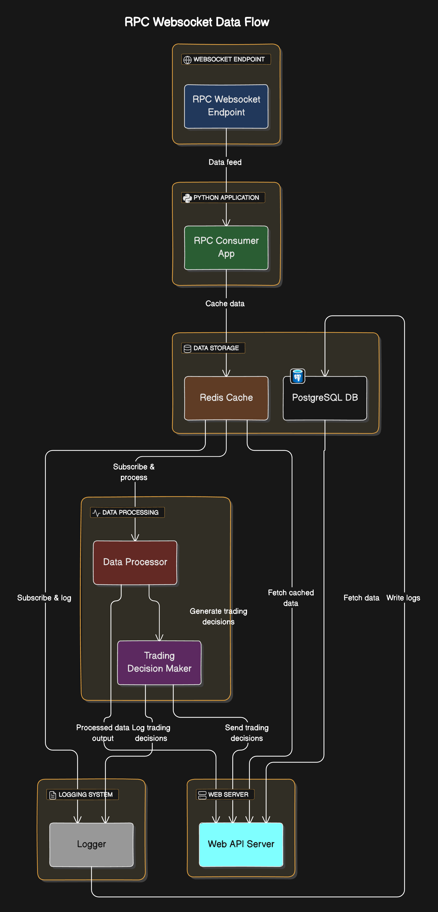

<h1>Solana Token Data Ingestor</h1>

## Description
This project, which is in progress, is an G/RPC listener that listens for token transactions on the Raydium Constant Product AMM on the Solana Blockchain. The ingestor primarily focuses on token swap transactions and token mints. It listens for these transactions and stashes the different trade volumes and token metadata properties in Redis then PostgreSQL. From there, the data is then served through a RESTful API to trading and analytical microservices. The token data processing is done in golang for speed, the client API is built using FastAPI, and the G/RPC listener is in pure python. The database used is PostgreSQL, and the ORM used is Prisma. Interservice communication is done primarily via Redis Pub/Sub. The project is deployed using Docker and Docker Compose. Redis Commander is used for debugging and monitoring.

## Tech Stack
| Icon | Name | Description |
|---|---|---|
|  | Python | For the G/RPC listener and API |
|  | FastAPI | For the API |
|  | Go | For token data processing |
|  | Redis | For caching and pub/sub |
|  | Docker | For containerization |
| | PostgreSQL | For persistent storage |

## Program Flow Proposal


## Installation and Build 

### Clone the repository
```bash
git clone https://github.com/Zaydo123/Solana-RPC-Listener
```
### Go to the project directory
```bash
cd Solana-RPC-Listener
```
### Create Environment Variables
Check the `.env.example` file in the root directory and create a `.env` file with the same variables and values.
<a href="./.env.example">Click here to view</a> 

Also, create a `.env` file in the `apps/prisma` directory with the following variables:

| Variable | Description |
|---|---|
| DATABASE_URL | The URL to the PostgreSQL database |
| POSTGRES_DB | The name of the PostgreSQL database |
| POSTGRES_USER | The username for the PostgreSQL database |
| POSTGRES_PASSWORD | The password for the PostgreSQL database |


### Dependencies for the Python API and G/RPC listener
change directory to both the `webapp` and `rpc-consumer` directories and run the following command:
```bash
pip install -r requirements.txt
```
### Running the API:
production run command
```bash
gunicorn -k uvicorn.workers.UvicornWorker main:app
```

development run command
```bash
uvicorn main:app --reload --port 3000 --host
```

### Running the RPC Consumer:
for both dev and prod run the following command:
```bash
python main.py
```

### Building the token data processor written in Go
to build from source, download Go and change directory to the `token-data-processor` directory.
Then run the following commands:
```bash
go build cmd/token-processor/main.go
```
run with the following command:
```bash
./main
```

### Applying database migrations
change directory to the `prisma` directory and run the following commands:
```bash
prisma generate
prisma migrate dev --name init
```

### Starting PostgreSQL, Redis, Redis Commander
Managed using Docker Compose. Run the following command in the root directory:
```bash 
docker compose up -d
```

Your application should now be running!
check redis commander at `127.0.0.1:8081` and the API at `127.0.0.1:3000`


## Notes
- The project is still in progress and is not yet complete.
- Trading services are not being shared in this repository.

## To Do
1. ~~Finish intrasession volume and pricing recording~~
2. ~~Add token.Update() function which caches token if last update has been X amount of time determined by env~~
3. Finish burn processing. Give time series data for token burns like volume and pricing.
4. ~~Schedule top holders update task~~
5. ~~Make logger for tokens for data persistance~~ -> logger will be merged into processor and given its own task thread
6. Make wss api and http api for interacting with processor - should fetch from redis and postgres
7. add “refresh” endpoint which can refetch a stale token or continue following a token
8. Migrate to GRPC instead of RPC on the listener 

